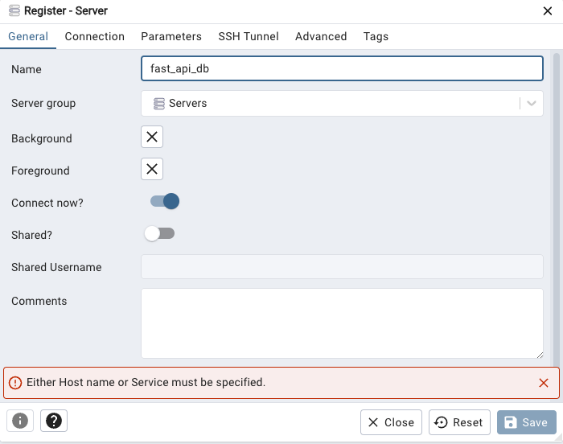
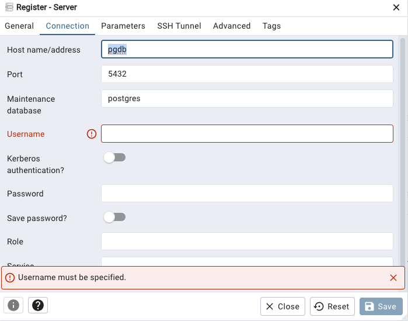
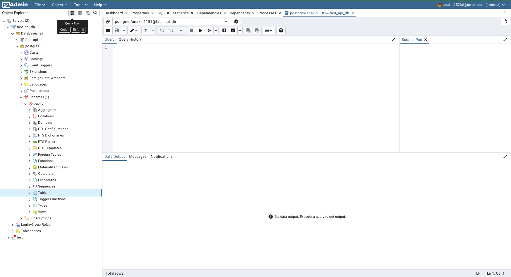

# FastAPI Database Application

## Introduction

This is a FastAPI-based REST API application that provides CRUD (Create, Read, Update, Delete) operations for managing items in a PostgreSQL database. The application is containerized using Docker and supports both poetry and pip-based deployments.

## Technology Stack

- **FastAPI**: Modern, fast web framework for building APIs with Python
- **PostgreSQL**: Powerful, open-source relational database
- **SQLAlchemy**: SQL toolkit and ORM for Python
- **Docker**: Containerization for consistent development and deployment
- **Pydantic**: Data validation using Python type annotations
- **pgAdmin**: Web-based PostgreSQL administration tool

## Installation

### Prerequisites

- Python 3.8 or higher
- Docker and Docker Compose

### Setup

1. Clone the repository:

```bash
git clone <repository-url>
cd fast-api-db
```

2. Create environment file:

```bash
cp .env.sample .env
```

3. Update the .env file with your desired configuration

## Usage

### Starting the Application

The application can be started using Docker Compose with either poetry or pip profile:

#### Using Poetry (Recommended)

```bash
docker compose --profile poetry up -d
```

#### Using Pip

```bash
docker compose --profile pip up -d
```

This will start:

- FastAPI application (http://localhost:8000)
- PostgreSQL database (port 5432)
- pgAdmin interface (http://localhost:5050)

### API Endpoints

- `GET /`: Health check endpoint
- `POST /items`: Create a new item
- `GET /items/{item_id}`: Retrieve an item
- `PUT /items/{item_id}`: Update an item
- `DELETE /items/{item_id}`: Delete an item

### API Documentation

- Swagger UI: http://localhost:8000/docs
- ReDoc: http://localhost:8000/redoc

### Development

For development purposes, the application uses volume mounts to enable hot-reloading:

- `./app`: Application code
- `./src`: Source code
- PostgreSQL and pgAdmin data are persisted in Docker volumes

## Debugging

For debugging capabilities, use the debug configuration:

```bash
docker compose -f docker-compose.debug.yml up -d
```

Then connect to the debug port 5678 using your IDE's remote debugger.

### Cleanup

To stop and remove all containers:

```bash
docker compose --profile poetry/pip down
```

To remove all data volumes:

```bash
docker compose --profile poetry/pip down -v
```

## GUI using pgAdmin

Access the pgAdmin GUI by going to ` http://localhost:5050`

### 1. Sign in using the credenitals in .env


### 2. Connect to the server

1. Click "Add new server"
2. Name the server using the project name
   
3. Use the name of database docker service as host (reference docker-comppose.yml) then sign in using username and password in .env file
   

### 3. Use the query tool to manage database


